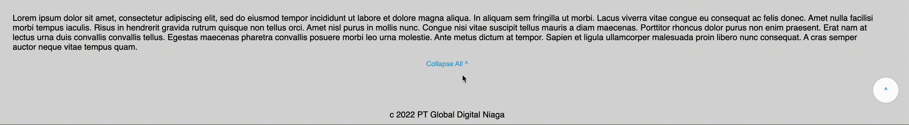

# Blibli UX Engineer Internship Test

## Preface
This repository is created for the purpose of Blibli UX Engineer Internship Test. Feel free to also check out my other repositories in [my GitHub profile](https://github.com/jon-mun)

## Written Test
The written test can be accessed through the following links:

- [PDF File](./Blibli-UX-Engineer-Internship-Written-Test.pdf)

- [Google Docs](https://docs.google.com/document/d/17P3y43u83rDGLuekEKrw5gXJvSUX2mbHvwp_NIHYEZs/edit#heading=h.i5qw0zwudrxa)

## Practical Test
### Deployment
Deployed Link: https://jon-mun.github.io/blibli-ux_engineer_internship-test/

### Functionality Showcase

#### 1. Footer Collapse

#### 2. Scroll To Top

#### 3. Products Scroll
